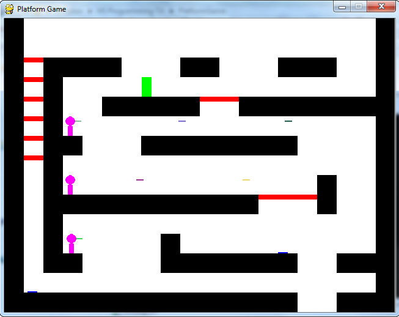

# Platform Game - (Level III)

*Challenge by Jack Boffa, HHS '14*

This project will give you experience writing graphical applications. You will also learn how to use classes and object-oriented programming to streamline your code.

## What to do

Use Python to create a sandbox platform game. A platform game is a 2D game with a player that jumps between 
platforms (like Super Mario Bros). “Sandbox” simply means that instead of having structured levels, the user 
creates their own environment and plays around in it. In this case, the user will be able to create various 
objects at the mouse pointer by pressing keys on the keyboard. They will also be able to control a player 
object using the arrow keys.

The game will look something like this:

You must include the elements labeled in the image:

1. Pressing 'w' creates a wall at the mouse. This is simply a square obstacle that blocks the movement 
   of the player and other objects. I recommend making the walls snap to a grid so you can make smooth platforms.
2. Pressing 'p' creates the player at the mouse (provided that there isn't already one on the screen). It is affected 
   by gravity, and falls down until a wall stops it. The user can move the player by pressing and holding the 
   left and right arrow keys. If the player is on the ground, the user can jump by pressing the up arrow key. These are some       basic characteristics, but feel free to add extra controls for the user or interesting properties.
3. Pressing 's' creates a spring at the mouse. If the player hits a spring, she will launch upwards (higher 
   than a jump takes it). Springs are also affected by gravity so that, when created, they fall and come to rest 
   on flat ground.

## Hint

Ggame comes with a [built in ability to detect collisions between sprites](http://brythonserver.github.io/ggame/#ggame.Sprite.collidingWithSprites), which may be useful.

## Extra ideas

There are lots of possibilities for extra features to add to your platform game.

1. A "platform" sprite that serves as a floor but not a ceiling. The player can jump through the 
   bottom of this platform, but will land on top of it.
2. A "laser turret" sprite that fires laser bolts at the player.
3. Enemies that walk along the ground.
4. A jetpack activated by holding the down arrow key.
5. Your own ideas!

